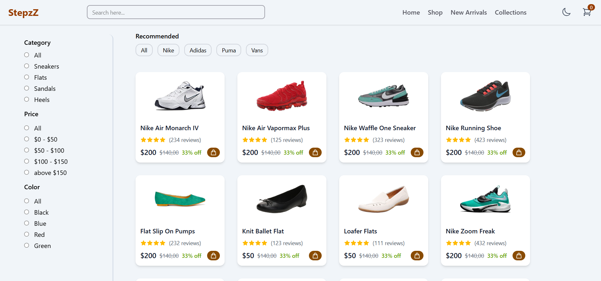

# E-Commerce Product Filtering Prototype 🛍️

An e-commerce product filtering interface built with React and Tailwind CSS, featuring advanced search and filtering capabilities.

## Live Demo 🌐

[View Live Demo](https://stepzz.netlify.app)

## Features ✨

- 🔍 **Advanced Product Filtering**

  - Category filters (Sneakers, Flats, Sandals, Heels)
  - Price range filtering
  - Color selection
  - Brand filtering (Nike, Adidas, Puma, Vans)
  - Real-time search functionality

- 🎨 **Modern UI Components**

  - Product cards with rating system
  - Interactive filters
  - Shopping cart indicator
  - Smooth animations and transitions

- ⚙️ **Technical Highlights**

  - Component-based architecture
  - Efficient state management
  - Lazy loading images
  - Clean and maintainable code structure