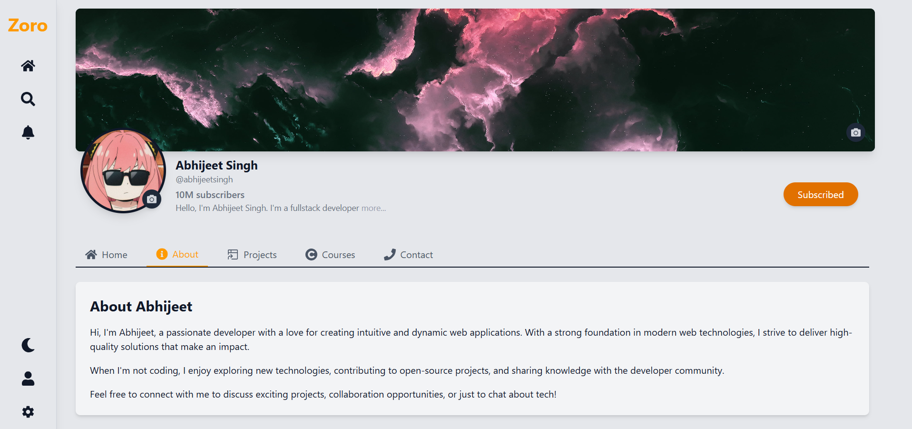
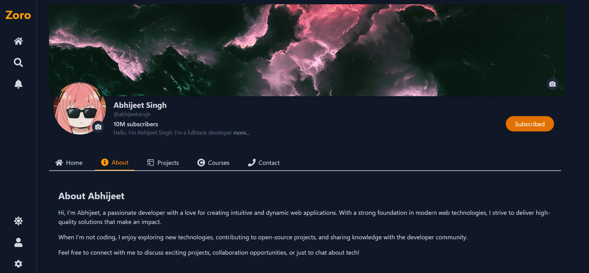

# React Profile Dashboard

A responsive profile dashboard built with React and TypeScript, implementing core concepts for learning purposes.

## Features

- 🌓 **Theme Switching**: Light/dark mode with localStorage persistence
- 📸 **Image Uploads**: Profile banner & picture upload capabilities
- 📩 **Contact Form**: Frontend-only implementation with console logging
- ⚡ **State Management**: Context API for theme management
- 🔄 **Local Storage**: Persists user preferences across sessions

## Technologies Used

## Installation

1. Create a new react app with vite using typescript.
2. Clean the project.
3. Paste all the files from this repo in their place according to the structure.
4. Start development server using `npm run dev`

# Project Structure

/react-profile-dashboard
├── src
│ ├── components # Reusable components
│ ├── context # Theme context provider
│ └── App.tsx # Main application entry
├── public
└── package.json

# Key Learning Points

- Context API implementation

- TypeScript fundamentals

- Form handling with react-hook-form

- File upload functionality

- LocalStorage integration
