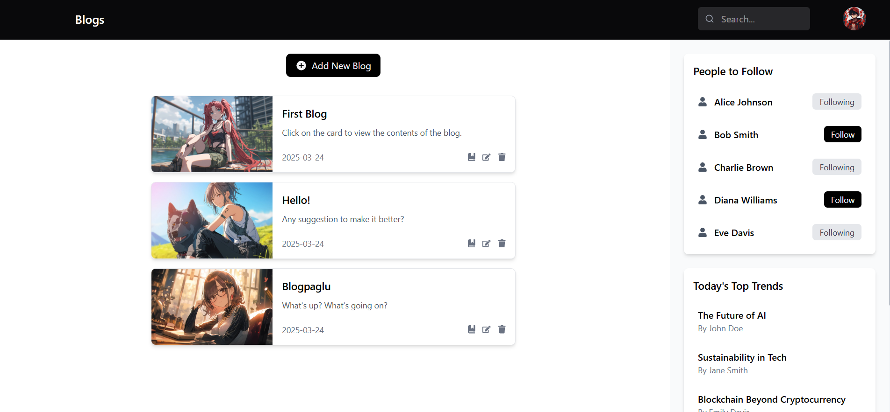

# React Blog Platform 📝

A modern blog platform with CRUD functionality, built with React and TypeScript. Features local storage persistence, responsive design, and interactive user interface.

## Live Demo 🌐

Experience the application live:  
https://blogu.netlify.app

## Features ✨

- 📌 **Full CRUD Operations** for blog posts
- 💾 **LocalStorage Integration** for data persistence
- 📱 **Mobile-First Responsive Design**
- ✨ **Interactive Modals** for viewing/editing posts
- 👥 **User Follow System** with persistent state
- 🔥 **Trending Topics & Recommendations**
- 🎨 **Modern UI** with Tailwind CSS styling
- 📦 **State Management** with React Context API

## Tech Stack 🛠️

- **Frontend**: React 18 + TypeScript
- **Styling**: Tailwind CSS
- **Icons**: React Icons
- **State Management**: Context API
- **Local Storage**: Web Storage API
- **Build Tool**: Vite

## Installation ⚙️

1. Create a new react app with vite using typescript.
2. Clean the project.
3. Paste all the files from this repo in their place according to the structure.
4. Start development server using `npm run dev`

## Usage 🚀
#### 1. Create New Blog
Click "Add New Blog" button to create new posts

#### 2. Edit/Delete Posts
Use the edit (✏️) and delete (🗑️) icons on blog cards

#### 3. View Full Post
Click anywhere on a blog card to view detailed content

/src
├── components
│   ├── ArticleCard.tsx
│   ├── ArticleList.tsx
│   ├── ArticleModal.tsx
│   ├── BlogForm.tsx
│   ├── Modal.tsx
│   └── Navigation.tsx
│   └── PeopleToFollow.tsx
│   └── TopicsList.tsx
│   └── TrendsList.tsx
│   └── UserCard.tsx
├── shared
│   └── BlogContext.tsx
├── App.ts
├── index.css
├── main.tsx
├── types.ts

Made with ❤️ by [Abhijeet Singh]
